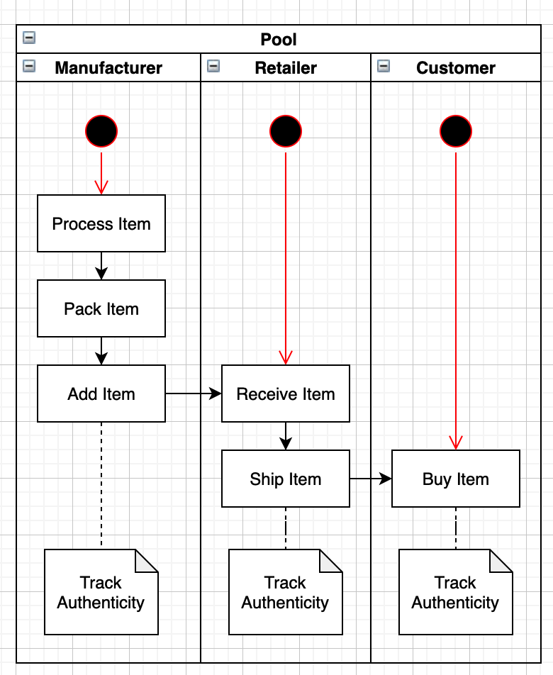
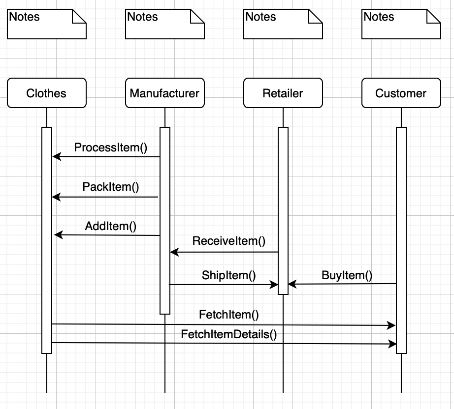
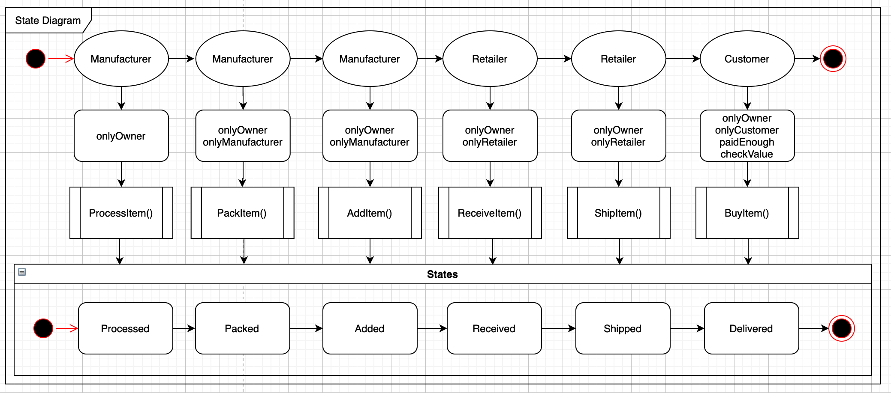
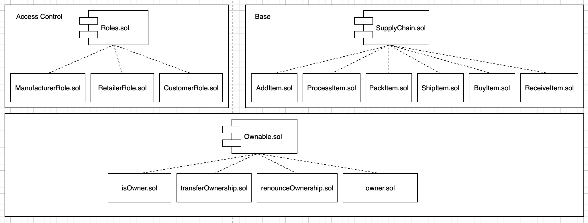

# Suppy Chain Dapp
__Ethereum Dapp for Tracking Items through Supply Chain__

1. [UML Diagrams](./README.md#uml-sheets)
1. [Libraries](./README.md#libraries)
1. [IPFS](./README.md#ipfs)
1. [Deployed Contracts](./README.md#deployed-contracts)
1. [Links](./README.md#links)

## UML Sheets

### Activity Diagram

### Sequence Diagram

### State Diagram

### Class Diagram

## Libraries
- Truffle Framework: A development environment, testing framework and asset pipeline for blockchains using the Ethereum Virtual Machine.
- Web3: Is a collection of libraries which allow you to interact with a local or remote ethereum node, using a HTTP or IPC connection.
- Infura: Scalable API access to the Ethereum and IPFS networks. 
- OpenZepplin: Contracts to help minimize risk by using battle-tested libraries of smart contracts for Ethereum and other blockchains.
- truffle-hdwallet-provider: HD Wallet-enabled Web3 provider. Use it to sign transactions for addresses derived from a 12 or 24 word mnemonic.

## IPFS
Not used in this project.

## Deployed Contracts
- Owner Account: [0x3a908323ab22931011FB368Bf6Bb997fC2d7d18f](https://rinkeby.etherscan.io/address/0x3a908323ab22931011FB368Bf6Bb997fC2d7d18f)

### SupplyChain

- TX hash: [0xd24e389f4d7f1ee519045882d38e4a0cac3f57a7ac9a6051f8175ba5c44370e8](https://rinkeby.etherscan.io/tx/0xd24e389f4d7f1ee519045882d38e4a0cac3f57a7ac9a6051f8175ba5c44370e8)
- Contract address: [0xdf7c5cc86b97220b854b06a323F8472AfaB17A43](https://rinkeby.etherscan.io/address/0xdf7c5cc86b97220b854b06a323F8472AfaB17A43)

### ManufacturerRole

- TX hash: [0xc8a27c76b99fefa601ae77aebe7b94031d10fea4f0aedd163fda3b9581168231](https://rinkeby.etherscan.io/tx/0xc8a27c76b99fefa601ae77aebe7b94031d10fea4f0aedd163fda3b9581168231)
- Contract address: [0xa47eADDD570C13295893B39E3FC8A966F16379fD](https://rinkeby.etherscan.io/address/0xa47eADDD570C13295893B39E3FC8A966F16379fD)
 
### RetailerRole
- TX hash: [0x45125691ffececed87e9725ea9d3f8b24c9f77d03d374a4b23676fbbe8abfd00](https://rinkeby.etherscan.io/tx/0x45125691ffececed87e9725ea9d3f8b24c9f77d03d374a4b23676fbbe8abfd00)
- Contract address: [0xA22078cA311aACDEDeb60296284DdCA3F4547928](https://rinkeby.etherscan.io/address/0xA22078cA311aACDEDeb60296284DdCA3F4547928)

### CustomerRole
- TX hash: [0x628398b99eeee7721d5d2fcee77ff2c6ff591af25a6edb76b5ca5e3bc57d7dae](https://rinkeby.etherscan.io/tx/0x628398b99eeee7721d5d2fcee77ff2c6ff591af25a6edb76b5ca5e3bc57d7dae)
- Contract address: [0x70CcDEF215E049f2B6a950af7916669cD9421149](https://rinkeby.etherscan.io/address/0x70CcDEF215E049f2B6a950af7916669cD9421149)

### Links

- [Project Starter Files](https://github.com/udacity/nd1309-Project-6b-Example-Template)
